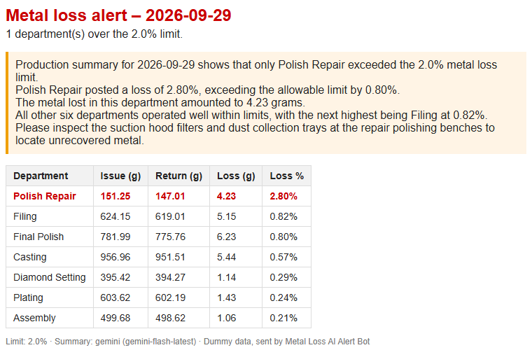
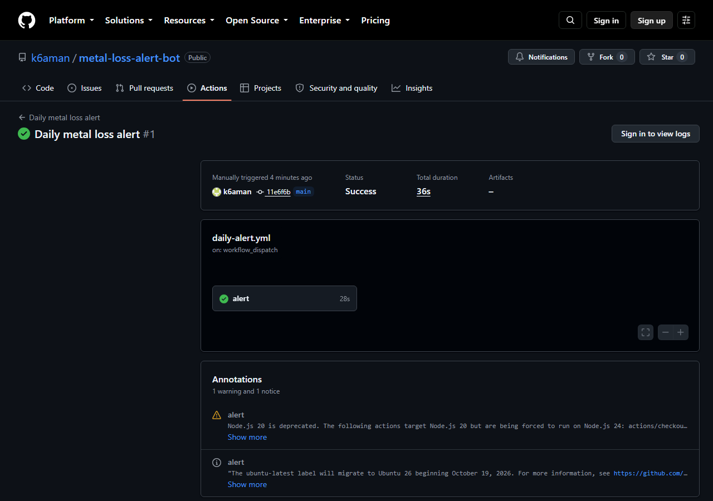
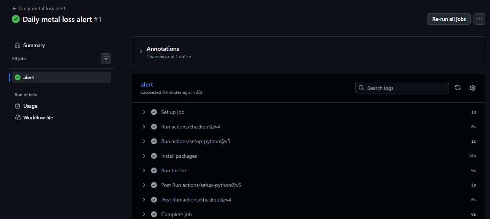
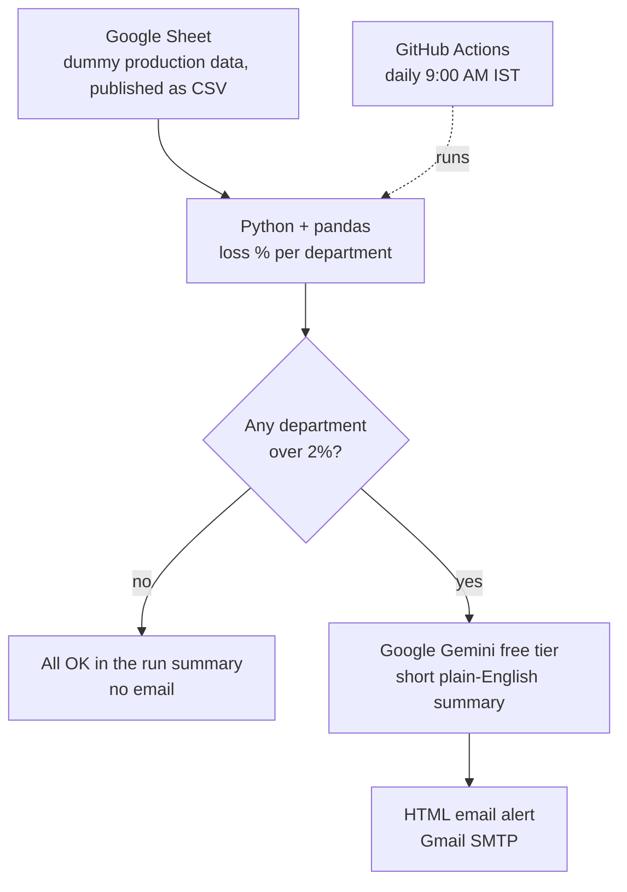

# Metal Loss AI Alert Bot

A small Python bot that checks metal loss for each department in jewellery manufacturing. When a department's loss goes over the limit, it uses Google Gemini to write a short plain-English summary and sends it as an email alert. GitHub Actions runs it once a day.

> **Dummy data only.** No real company data is used in this project.

## Problem

In jewellery manufacturing, some gold or silver is lost at every step (casting, filing, polishing, setting). A small rise in loss % costs real money. It is easy to miss when you only look at reports now and then. This bot checks every day and sends an alert only when a department crosses the limit.

## Screenshots

**Alert email** (day with a department over 2%, summary written by Gemini):



**GitHub Actions run** (runs in the cloud, about 30 seconds):



**Job steps** (install packages, then run the bot):



## How it works



1. **Read data:** the bot downloads the published Google Sheet as CSV (no login needed).
2. **Check loss:** pandas calculates loss % = (issue − return) ÷ issue × 100 for each department on the chosen day.
3. **Flag:** any department over the 2% limit is flagged. If none, the run ends with "All OK".
4. **Summarise:** Gemini gets the loss table and writes a 4–6 line summary with one thing to check. If Gemini is busy or down, a simple built-in summary is used instead.
5. **Alert:** an HTML email with the summary and the loss table (flagged rows in red) is sent through Gmail.
6. **Schedule:** GitHub Actions runs all of this every morning in the cloud, so my PC does not need to be on.

## Project structure

```
bot/
  config.py        limit, Sheet link, Gemini model names
  loss_check.py    read data, loss % per department, flag > 2%
  ai_summary.py    Gemini summary with backup model, retries and fallback
  send_email.py    build the HTML email and send it with Gmail SMTP
  main.py          full run: check → summary → email (+ job summary)
data/
  generate_dummy_data.py   makes the dummy data (fixed seed)
  dummy_metal_loss.csv     local copy of the data
.github/workflows/daily-alert.yml   daily schedule + manual run button
```

## Tools (all free)

| Tool | Use |
|---|---|
| Python 3.12 + pandas | Read the data and calculate loss % |
| Google Sheets (published as CSV) | Dummy production data, no login needed |
| Google Gemini API (free tier, Google AI Studio) | AI summary of the alert |
| Gmail SMTP (App Password) | Send the alert email |
| GitHub Actions | Run the bot every day on a schedule |

## Data

Dummy production data: 30 days (1–30 Sep 2026) × 7 departments = 210 rows.

| Column | Meaning |
|---|---|
| `date` | Production date |
| `department` | Casting, Filing, Assembly, Diamond Setting, Final Polish, Polish Repair, Plating |
| `metal_type` | 18K Gold, 14K Gold or Silver 925 |
| `issue_weight_g` | Metal given to the department (grams) |
| `return_weight_g` | Metal returned by the department (grams) |

Loss % = (issue − return) ÷ issue × 100. Five rows are set above the 2% limit on purpose so the bot has alerts to send.

- Generator: [`data/generate_dummy_data.py`](data/generate_dummy_data.py) (fixed seed, so it makes the same data every time)
- Local copy: [`data/dummy_metal_loss.csv`](data/dummy_metal_loss.csv)
- Published Google Sheet (CSV, read-only, no login needed): [dummy_metal_loss.csv](https://docs.google.com/spreadsheets/d/e/2PACX-1vQoY_WG5HV6JIMJINpsUofVehYBL2upPPFu6T_aVVLmdbvjD7_SESpfcyuiPl6hfGgCRfglvwXUUkWF/pub?output=csv)

## Run locally

```bash
python -m venv .venv
.venv\Scripts\activate          # Windows
pip install -r requirements.txt
```

Check loss % per department (prints a table and lists departments over 2%):

```bash
python -m bot.loss_check                     # latest day, from the Google Sheet
python -m bot.loss_check --date 2026-09-29   # a chosen day
python -m bot.loss_check --local             # use the local CSV (offline)
```

The 2% limit and the Sheet link are set in [`bot/config.py`](bot/config.py).

### AI summary (Google Gemini)

1. Get a free API key from [Google AI Studio](https://aistudio.google.com/apikey) (no card needed).
2. Copy [`.env.example`](.env.example) to `.env` and paste the key as `GEMINI_API_KEY`. `.env` is never committed.
3. Run:

```bash
python -m bot.ai_summary --date 2026-09-29   # a day with a department over 2%
python -m bot.ai_summary --local             # latest day, local CSV
```

Gemini gets the loss table and writes a 4–6 line summary: which departments crossed the limit, by how much, and one thing to check. If the main model is busy, it tries a lighter backup model and retries a few times. If the key is missing or every try fails, the bot prints a simple fallback summary instead of crashing. If no department is over the limit, Gemini is not called. The model names and retry settings are set in [`bot/config.py`](bot/config.py).

### Email alert + full run

1. Turn on [2-Step Verification](https://myaccount.google.com/signinoptions/twosv) for the Gmail account that sends the alert.
2. Create an [App Password](https://myaccount.google.com/apppasswords) (16 letters). It is used instead of the normal Gmail password.
3. Add to `.env`: `GMAIL_USER`, `GMAIL_APP_PASSWORD` and `ALERT_TO` (see [`.env.example`](.env.example)).
4. Run the full bot:

```bash
python -m bot.main                           # latest day, from the Google Sheet
python -m bot.main --date 2026-09-29         # a day with a department over 2%
python -m bot.main --date 2026-09-29 --dry-run   # save the email to out/alert_preview.html, do not send
```

Flow: loss check → if any department is over 2% → Gemini summary → HTML email with the summary and the loss table (departments over the limit in red). If every department is within the limit, it prints "All departments within limit" and sends nothing. Email uses Python's built-in `smtplib`, so there is nothing extra to install.

## Daily run (GitHub Actions)

[`.github/workflows/daily-alert.yml`](.github/workflows/daily-alert.yml) runs the bot in GitHub's cloud every day at **9:00 AM IST** (03:30 UTC), so nothing runs on my PC.

- **Secrets:** the keys from `.env` are saved as repository secrets (Settings → Secrets and variables → Actions): `GEMINI_API_KEY`, `GMAIL_USER`, `GMAIL_APP_PASSWORD`, `ALERT_TO`. They are never in the code or the logs. The Sheet link is public, so it stays in `bot/config.py`.
- **Manual run:** Actions tab → *Daily metal loss alert* → *Run workflow*. Optional inputs: a date (e.g. `2026-09-29`, a day with alerts) and *dry run* (do not send the email).
- **Run log:** each run writes the loss table, the status and the AI summary to its job summary page.

GitHub may start scheduled runs a few minutes late, and pauses them if the repo has no activity for 60 days.

## What I learned

- **Calling an LLM from code:** sending data to Gemini with a clear prompt, and handling the free tier being busy (503) with a backup model, retries and a fallback text, so the alert still goes out.
- **Keeping secrets safe:** API key and Gmail App Password live in `.env` locally and in GitHub Actions secrets in the cloud, never in the code.
- **Scheduling in the cloud:** a GitHub Actions cron job with a manual run button, inputs (date, dry run) and a job summary page for each run.
- **Alert only when needed:** the email is sent only when a department crosses the limit, so people do not start ignoring it.

This project is based on the metal-loss tracking I do in my data analyst job at a jewellery manufacturer, rebuilt with dummy data.

## Next ideas

- Different limits per department or metal type (e.g. higher for Polish Repair).
- Weekly trend: flag a department whose loss keeps going up, even below 2%.
- Send the alert to WhatsApp or Telegram as well as email.
- Save each day's result to a sheet and show the trend in a Power BI or Looker Studio dashboard.

## Status

- [x] Step 1: Repo setup (README, .gitignore, requirements.txt)
- [x] Step 2: Dummy production data in Google Sheets
- [x] Step 3: Calculate loss % per department and flag > 2%
- [x] Step 4: Gemini summary
- [x] Step 5: Email alert + `main.py`
- [x] Step 6: Daily run with GitHub Actions
- [x] Step 7: Final README, screenshots, pin on profile
